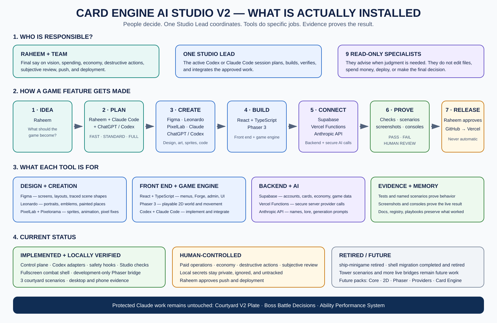
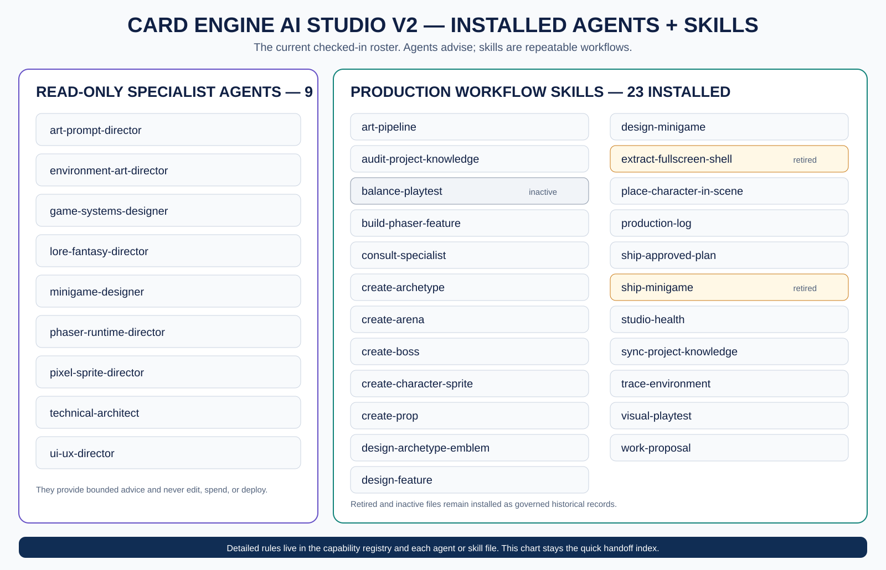

# Card Engine AI Studio Architecture V2

**Status:** Installed and live-verified locally on 2026-08-03; awaiting Raheem's final push/deploy approval
**Audience:** Raheem, future studio teammates, and whichever primary Codex or Claude Code session is serving as Studio Lead
**Purpose:** explain the studio simply enough to understand, operate, and teach without reading every agent and skill file.

## Approval record

Raheem approved the complete Studio V2 direction on **August 2, 2026**:

- the human-governed Studio Lead operating model;
- FAST, STANDARD, and FULL work modes;
- universal approval before paid operations;
- the Phaser runtime bridge, named-scenario, and visual-playtest direction;
- the PixelLab MCP/API + Sprite Lab + Pixelorama workflow, with Aseprite deferred;
- the one-time shared `FullscreenGameShell` migration during Handoff B;
- controlled installation and live validation of this control plane.

Approval authorizes implementation, not silent spending, deployment, destructive operations, or bypassing evidence gates. The shared fullscreen shell is now implemented and live-checked in combat. Raheem retired `ship-minigame` on **August 3, 2026** because that minigame is no longer wanted; it is not a release dependency.

---

## The idea in one sentence

**Card Engine is built by an AI-native game studio in which humans make the important decisions, one primary implementation session integrates the work, read-only specialists give focused advice, skills run repeatable production workflows, tools execute, and evidence determines whether the result is done.**

Card Engine is Project 001 and the proving ground. After the workflow is strong and stable here, its reusable parts can become a portable 2D game-development studio for Raheem and a coworker.

---

## The architecture at a glance





The original predicted map remains preserved separately; these versioned images show the current installed Studio and can be updated without overwriting it.

The architecture has five operating layers:

1. **Authority and routing** — Raheem/team, the Studio Lead, and the control plane.
2. **Specialist judgment** — read-only directors who advise only when their expertise is needed.
3. **Production workflows** — skills that design, generate, build, verify, ship, and synchronize.
4. **Execution and evidence** — providers, code tools, Phaser, validators, runtime state, screenshots, and video.
5. **Durable memory** — canonical docs, generated references, playbooks, fixtures, and harvested reusable components.

## What is actually installed today

| Area | Current truth |
|---|---|
| Studio control plane | Implemented under `.claude/`. Structural checks, routing fixtures, failure-prevention tests, and release health checks pass. |
| Codex support | Checked-in adapters under `.agents/` and `.codex/`, including read-only specialist sandboxes and fail-closed human gates. |
| Shared fullscreen shell | Implemented at `card-engine/src/pages/games/FullscreenGameShell.tsx`; combat uses it and has passed desktop, phone, Turn 1 → Turn 2, screenshot, and clean-console checks. |
| Phaser observation bridge | Implemented as a development-only courtyard adapter. Direction, collision/occlusion, and reduced-motion scenarios all pass live with clean consoles and screenshots; production-bundle exclusion is separately verified. |
| Minigame shipping | Retired by Raheem. Existing game code is not deleted, but the `ship-minigame` workflow is hidden and cannot be invoked. |
| Human gates | Paid providers, economy changes, destructive actions, deployment, and subjective visual approval remain human-controlled. |

Local provider credentials remain a private-device exception accepted by Raheem. Studio automation does not inspect or modify their contents; it verifies only that the local secret files are ignored and untracked. This exception must be revisited before the repository becomes shared or public. The remaining release gate is human approval to push and deploy.

---

# 1. Who owns what

## Raheem and the team — final authority

Humans own decisions that should not be delegated to an automated workflow:

- game vision and creative direction;
- player experience and product direction;
- economy changes;
- paid-service spending;
- destructive operations;
- deployment and release decisions;
- final subjective visual and play-feel judgment;
- whether a lesson becomes a permanent studio convention.

The studio should reduce clerical work, not hide consequential choices.

## Primary implementation session — Studio Lead

The primary Codex or Claude Code session is the only AI role that integrates and implements the final work. It:

- understands the request;
- refreshes relevant project truth;
- chooses the smallest safe work mode;
- consults specialists only when judgment is genuinely needed;
- runs or follows the correct skill;
- edits code and project files;
- runs deterministic checks;
- requests runtime/visual evidence;
- reports decisions, risks, evidence, and unresolved human judgment;
- synchronizes documentation after approved work;
- proposes reusable improvements without silently installing them.

The Studio Lead is not an all-knowing authority. It is the coordinator and integrator.

## Specialist directors — advisory only

Specialists exist for narrow, recurring decisions where the project has learned that generic implementation judgment is not enough.

They are read-only. They do not edit files, create branches, run shell commands, spend money, or declare project truth.

### Game and narrative

- **Game Systems Director** — balance, economy-connected numerical design, generic mechanical shapes.
- **Lore/Fantasy Director** — archetype identity, Story Pillars, bosses, factions, narrative continuity.
- **Minigame Director** — loop, session structure, moment-to-moment feel, ability connection; not balance authority.

### Experience and architecture

- **UI/UX Director** — flows, navigation, mobile behavior, accessibility, hierarchy, visual competition with card art.
- **Technical Architect** — schemas, persistence, RLS, APIs, provider boundaries, storage, cross-system architecture.
- **Phaser Runtime Director** — scenes, lifecycle, camera, physics, collisions, animation, runtime observation, Phaser Editor decisions.

### Art production

- **Art/Prompt Director** — current Image Engine, portrait continuity, emblems, prompt architecture, art-direction collisions.
- **Environment Art Director** — plates, arenas, props, composition contracts, perspective, finishing, manifest integration.
- **Pixel Sprite Director** — PixelLab characters, direction mapping, frame consistency, animation integrity, packing, validation.

Specialists return a ruling, not a menu of ten equivalent ideas.

---

# 2. Agents, skills, tools, and documents are different things

This distinction is the core of the studio.

## Agents answer: “What is the right decision?”

An agent provides judgment when multiple defensible answers exist.

Example:

> Should this new Phaser camera behavior be scene-specific or a reusable camera-state component?

The Phaser Runtime Director reads the relevant code and returns a recommendation and risks. It does not implement it.

## Skills answer: “What repeatable process should we follow?”

A skill has stable inputs, steps, gates, outputs, and verification.

Example:

> Create and integrate a four-direction PixelLab character.

The workflow includes identity intake, generation strategy, cost gate, packing, validation, manifest registration, placement, runtime direction test, visual evidence, and approval.

## Tools answer: “What capability performs the work?”

Examples:

- PixelLab MCP generates or edits pixel assets.
- Pixelorama lets a human make precise visual corrections.
- Leonardo produces portraits and environment plates.
- Figma holds canonical interface design and traced colliders/occluders.
- Phaser runs the game.
- Playwright performs named browser scenarios and captures evidence.
- Git, Supabase, and code tools implement and persist the result.

A tool is not an art director, designer, or architecture authority.

## Documents answer: “What is already true?”

Canonical documents and generated references preserve approved truth. They prevent every new session from rebuilding the project from memory.

The truth hierarchy remains:

1. current implementation;
2. current Figma design for interfaces;
3. generated code references;
4. canonical topical documents;
5. approved plans and decision records;
6. previous conversations;
7. general assumptions.

Archive documents explain history but do not govern current work.

---

# 3. How a request moves through the studio

## Step 1 — Understand the request

The Studio Lead identifies:

- intended player or production outcome;
- affected systems;
- whether a decision is already canonical;
- whether the request is implementation, design, production, verification, or repair;
- whether it touches money, credentials, deployment, economy, schemas, or subjective visuals.

## Step 2 — Choose a work mode

### FAST

Use for isolated, low-risk work where the correct answer is already known:

- exact copy correction;
- formatting;
- narrow CSS bug;
- typo or import repair;
- implementation of an exact canonical value;
- deterministic documentation correction.

The Studio Lead works directly. No specialist is invoked unless a risk trigger appears.

### STANDARD

Use for normal feature, art, or integration work with one clear domain.

- one primary specialist at most;
- one existing skill;
- normal verification;
- human interruption only at established gates.

### FULL

Use for high-impact or cross-discipline work:

- new game system;
- schema/persistence change;
- economy change;
- major UI flow;
- paid art campaign;
- new Phaser architecture;
- feature spanning code, art, runtime, and documentation.

The workflow requires:

- written proposal;
- no more than two primary specialists unless Raheem approves broader review;
- explicit human approval before implementation;
- complete deterministic and runtime evidence;
- documentation synchronization and harvest review.

The smallest safe mode wins. “More agents” is not automatically better.

## Step 3 — Consult only the needed specialist

The Studio Lead uses the capability registry to choose one primary specialist. A second specialist is added only when the decision genuinely crosses domains.

Specialist output follows one shape:

```text
RULING
WHY
RISKS
RECOMMENDED ACTION
CANONICAL SOURCES READ
HUMAN DECISION NEEDED
```

The Studio Lead may accept, adapt, or reject the recommendation, but must state why when the advice is materially overridden.

## Step 4 — Run the production skill

Every active skill should identify:

```text
TRIGGER
EXCLUSIONS
INPUTS
PREFLIGHT
WORKFLOW
APPROVAL GATES
VERIFICATION
OUTPUTS
HARVEST REVIEW
```

Shared rules live in shared references rather than being copied into every skill.

## Step 5 — Execute with the right capability

The skill uses code, Figma, PixelLab, Leonardo, Phaser, Supabase, or other tools. Paid and destructive operations stop at their human gate.

## Step 6 — Prove the result

“Build succeeded” is not sufficient for game work.

Evidence can include:

- typecheck, lint, unit tests, and build;
- schema and manifest validation;
- sprite and asset validators;
- runtime state from the Phaser observation bridge;
- browser console output;
- screenshots at actual gameplay scale;
- video for movement, camera, animation, or timing;
- mobile and desktop scenarios;
- a final `PASS`, `FAIL`, or `HUMAN REVIEW` verdict.

`HUMAN REVIEW` is not failure. It means the remaining question is creative or experiential rather than mechanically provable.

## Step 7 — Ship, synchronize, and harvest

Approved work is registered and documented. The final workflow asks:

> Did this task teach the studio something stable and reusable?

Possible recommendations:

- reusable component;
- validator rule;
- regression fixture;
- skill step;
- specialist trigger;
- design token;
- Phaser scenario;
- provider blueprint;
- canonical document update.

Nothing is added automatically merely because it was noticed.

---

# 4. The new Phaser layer

Phaser is the runtime heart of the 2D studio. The current project already has useful scene code and development handles, but the Studio Lead cannot consistently inspect what the game is doing or prove that visual behavior works.

V2 adds three pieces.

## Phaser Runtime Director

A read-only specialist consulted before changes to:

- scene architecture and lifecycle;
- camera behavior;
- physics and collisions;
- depth/occlusion;
- runtime animation integration;
- scene-to-React event contracts;
- performance-sensitive rendering;
- Phaser Editor MCP adoption;
- the runtime observation bridge.

## Runtime observation bridge

A development-only, stable interface exposes just enough state for testing without coupling tests to private scene internals.

Conceptually:

```ts
window.__CARD_ENGINE_STUDIO__ = {
  version: 1,
  listScenarios(),
  runScenario(name),
  getSnapshot(),
  clearScenario()
};
```

It should describe scene, player, camera, animation, collision, depth, scenario, and errors. It must not ship sensitive data or production-only debug controls.

## Visual playtest

Named scenarios start a known state, perform a repeatable interaction, collect state and visual evidence, and return:

- `PASS` — objective criteria passed;
- `FAIL` — objective criteria failed, with evidence;
- `HUMAN REVIEW` — mechanics pass, but appearance or feel needs Raheem/team judgment.

The implemented Card Engine scenario set is deliberately limited to behavior that exists today:

- `courtyard-direction-validation`;
- `courtyard-collision-and-occlusion`;
- `courtyard-reduced-motion-walk`.

Tower scenarios remain future work because there is no matching Phaser tower scene to observe. Forge Strike is a React surface, not a Phaser scene, and its former shipping workflow is retired.

Repeatable scenarios use a compatible browser runner that can call the development bridge in the page's main execution world. Browser tools that isolate evaluation from page globals may still capture screenshots and console evidence, but cannot certify these named scenarios by themselves.

---

# 5. The improved PixelLab layer

PixelLab is a provider capability inside existing sprite and asset workflows. It does not need its own decision-making agent.

The V2 correction ladder is:

1. deterministic local correction;
2. targeted official PixelLab MCP/API edit;
3. manual Pixelorama correction;
4. regeneration only when the asset cannot be repaired safely.

The project records generation provenance and cost, validates the result, and finally judges the asset inside Phaser at actual gameplay scale.

Aseprite remains optional. It should be added only after repeated evidence shows that Pixelorama and existing deterministic scripts cannot handle exact multi-frame corrections efficiently.

---

# 6. What V2 changes in the current studio

## V2 preserves

- Raheem’s authority;
- one primary implementation agent;
- read-only specialist concept;
- failure-driven agent triggers;
- existing production skills;
- canonical documentation discipline;
- Figma as canonical interface design;
- deterministic asset harnesses;
- paid-operation and economy gates;
- the rule against unnecessary agent/skill sprawl.

## V2 repairs

- malformed skill frontmatter;
- broken document links;
- active references to retired Image Engine documents;
- advisory agents with shell access;
- routing tables that omit existing specialists;
- missing checked-in permission and hook configuration;
- shell-script line-ending failures;
- inactive scaffold skills occupying active discovery;
- the missing shared fullscreen shell, now extracted from combat and live-checked without changing combat behavior;
- duplicated shipping instructions;
- documentation that assumes nobody else will use the studio.

## V2 adds

- a machine-readable capability registry;
- FAST/STANDARD/FULL work modes;
- a zero-dependency studio linter;
- project permission rules and deterministic hooks;
- standard specialist and skill contracts;
- Phaser Runtime Director;
- a development-only Phaser runtime observation bridge;
- three named courtyard visual-playtest scenarios;
- structured evidence verdicts;
- a formal harvest step;
- a simple architecture map for people.

---

# 7. How this becomes a coworker-ready studio

The first goal is not immediate extraction. The first goal is to make the system worth sharing.

After V2 is proven in Card Engine, it can be separated into:

## Studio Core

- authority model;
- routing and work modes;
- capability registry;
- technical, UI/UX, and game-systems specialists;
- design, shipping, documentation, health, and harvest workflows;
- permission and hook policy;
- installation and update mechanism.

## 2D Production Pack

- environment production;
- pixel-sprite production;
- props, bosses, effects, and animation workflows;
- asset provenance and validation.

## Phaser Pack

- Phaser Runtime Director;
- feature-building workflow;
- runtime bridge contract;
- named scenarios;
- visual-playtest workflow;
- optional Phaser Editor MCP adapter.

## Provider Packs

- PixelLab;
- Leonardo;
- Figma integration;
- future providers.

## Card Engine Project Pack

- lore and archetypes;
- card-specific generation;
- economy governance;
- minigame registrations;
- Card Engine routes, schemas, manifests, and design rules.

A coworker should install the stable studio package, connect their own accounts, clone or create a project, and receive the workflow—not Raheem’s credentials or every Card Engine-specific assumption.

---

# 8. The simplest explanation to give a teammate

> We run one primary Codex or Claude Code session as the Studio Lead. It reads the project’s canonical truth, chooses a fast, standard, or full workflow, and consults a read-only specialist only when a real design judgment is needed. Skills tell it how to perform recurring work. PixelLab, Leonardo, Figma, React, Phaser, Supabase, Vercel, and code tools execute the work. Deterministic checks and visual gameplay evidence decide whether the work passes. Human judgment remains the final gate for creative, economy, spending, deployment, and subjective visual decisions. Every proven lesson can become reusable studio memory, but no agent rewrites the studio without approval.

That is the Card Engine AI Studio V2.
